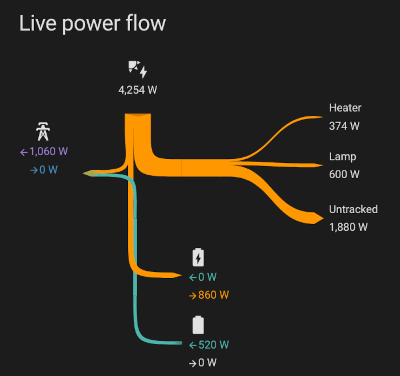

# Energy Sankey

Energy Sankey is a collection of dashboard cards for homeassistant, dynamically displaying the flow of electrical energy and power.

The cards are ideal if you want to track your energy consumption and identify where your energy is going.

There are two main card:
 - a card showing the total _energy_ flow based on a configurable time range (e.g. day so far).
 - a user configurable card showing the _power_ flow for a set of sensors. This represents the live power flow at the current moment.

Both cards base their configuration on the existing home assistant power configuration.

Both are live and automatically updating. The cards try to display a coherent representation even if the data set is incomplete or physically impossible (e.g. exporting more than the total generated). This means it is ok for asynchronous updates to be made to any of the entities it is listening for. 

The width of the flows represents the amount, and the overall size of everything is automatically scaled so that no one part of the diagram becomes too wide.

The diagram dynamically scales to fit the size of the window it is in (mostly).

Outstanding issues to solve:
- [ ] Sometimes there are thin dark lines between the blocks that make up the shapes, I believe this is caused by antialiasing, but I don't see an easy way of reducing/eliminating it, especially where the shapes are across two divs.
- [ ] I am not sure how to set the minimum width of the card, or what is the standard practice here. If I shrink the window horizontally, eventually the svg elements start to spill off the card. I'm sure that this is not the desired behaviour, but I don't know how to fix it (suggestions welcome!).
- [ ] If you stretch the card really wide, it sort of looks a bit silly. Perhaps that's not a major issue though.
- [ ] There are probably more edge cases to experiment with, such as multiple generation sources, grid configured with only input or output, and either of those being negative to represent flow in the opposite direction.

- [ ] Battery storage is not supported yet. That could be added in the future.